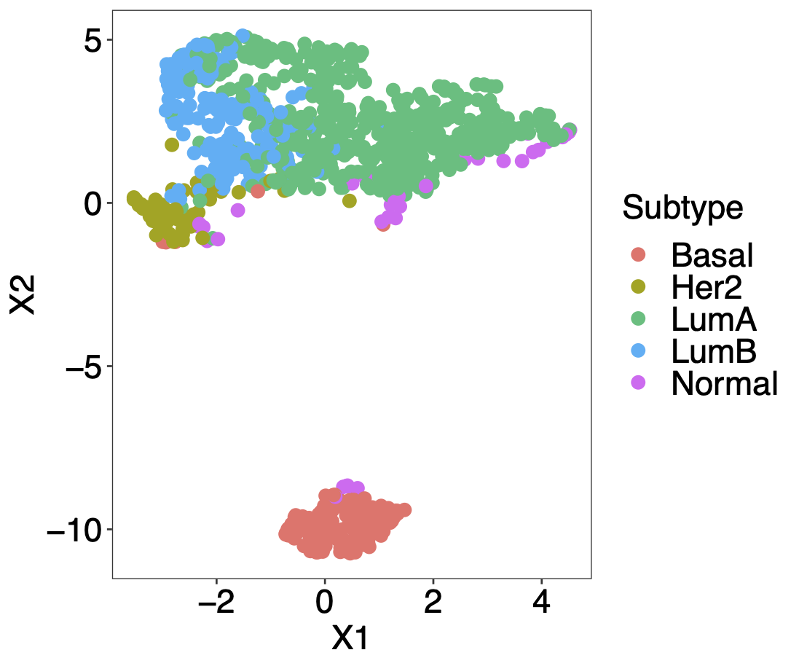
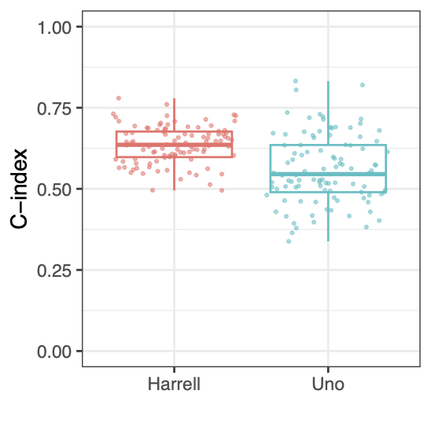
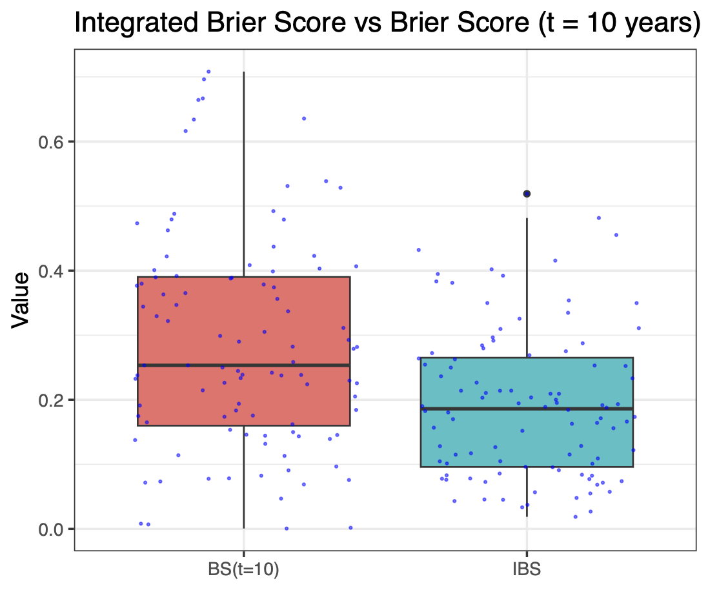

```{r, include=FALSE}
knitr::opts_chunk$set(
  comment = '', eval = FALSE
)
```
<br>
This is an [R Markdown](http://rmarkdown.rstudio.com) supplement for the article [**_Tutorial on survival modelling with omics data_**](https://arxiv.org/abs/2302.12542).

# Introduction {-}

[The Cancer Genome Atlas](https://www.cancer.gov/about-nci/organization/ccg/research/structural-genomics/tcga) (TCGA) provides an enormous collection of cancer data sets, including survival, clinical and multi-omics data.

:::{.green-box}
We will use TCGA data to demonstrate:

- The different data types
- Preprocessing of survival and omics data
- Analysis of survival data by classical statistical methods
- Unsupervised learning for omics data
- Frequentist & Bayesian supervised learning for survival and omics data
:::

# TCGA survival and clinical data {-}

The R/Bioconductor package [**TCGAbiolinks**](https://bioconductor.org/packages/TCGAbiolinks/) [@Mounir2019] provides a few functions to download and preprocess clinical and multi-omics data from the [Genomic Data Commons](https://gdc.cancer.gov/) (GDC) Data Portal for further analysis.

First we load all necessary libraries used in this tutorial except [**mlr3** libraries](#mlr3) which will be introduced later. 
Then we use function `GDCquery_clinic()` from **TCGAbiolinks** package to query and download TCGA survival and clinical data from multiple cancer types:

```{r}
# load all libraries used in this tutorial except mlr3
library("TCGAbiolinks")
library("SummarizedExperiment")
library("DESeq2")
library("dplyr")
library("ggplot2")
library("survival")
library("survminer")
library("M3C")
library("glmnet")
library("plotmo")
library("grpreg")
library("SGL")
library("psbcGroup")
library("GGally")
library("BhGLM")
library("risksetROC")
library("riskRegression")
library("peperr")
library("c060")
library("rms")
library("survAUC")
library("regplot")
```

```{r}
# download the clinical data and extract data for multiple cancers using GDC api method
cancer_types = c("TCGA-BLCA", "TCGA-BRCA", "TCGA-COAD", "TCGA-LIHC", 
                  "TCGA-LUAD", "TCGA-PAAD", "TCGA-PRAD", "TCGA-THCA")
clin = NULL
for (i in seq_along(cancer_types)) {
  tmp = TCGAbiolinks::GDCquery_clinic(project = cancer_types[i], type = "clinical")
  clin = rbind(clin, tmp[, c("project", "submitter_id", "vital_status", 
                              "days_to_last_follow_up", "days_to_death", 
                              "age_at_diagnosis", "gender", "race", 
                              "ethnicity", "ajcc_pathologic_t")])
}

# extract the observed time for each patient and use years as unit
clin$time = apply(clin[, c("days_to_death", "days_to_last_follow_up")], 1, max, na.rm = TRUE) / 365.25
clin$age = clin$age_at_diagnosis / 365.25
clin$status = clin$vital_status
clin = clin[, c("project", "submitter_id", "status", "time", "gender", "age", "race", "ethnicity")]

clin = clin[(clin$time > 0) & (clin$status %in% c("Alive", "Dead")), ]

# frequency table of the patients w.r.t. status, gender and ethnicity
clin %>%
  count(status, gender, ethnicity) %>%
  group_by(status) %>%        
  mutate(prop = prop.table(n))
```

```
# A tibble: 12 × 5
# Groups:   status [2]
   status gender ethnicity                  n    prop
   <chr>  <chr>  <chr>                  <int>   <dbl>
 1 Alive  female hispanic or latino        75 0.0240 
 2 Alive  female not hispanic or latino  1367 0.438  
 3 Alive  female not reported             328 0.105  
 4 Alive  male   hispanic or latino        34 0.0109 
 5 Alive  male   not hispanic or latino  1041 0.334  
 6 Alive  male   not reported             276 0.0884 
 7 Dead   female hispanic or latino         7 0.00809
 8 Dead   female not hispanic or latino   377 0.436  
 9 Dead   female not reported              64 0.0740 
10 Dead   male   hispanic or latino        10 0.0116 
11 Dead   male   not hispanic or latino   327 0.378  
12 Dead   male   not reported              80 0.0925 
```

```{r}
# censoring plot by cancer types
clin %>%
  mutate(index=1:n()) %>%
  ggplot(
    aes(y = index, x = time, colour = project, shape = factor(status))) +
    geom_segment(aes(x = time, y = index, xend = 0, yend = index)) +
  geom_point() +
  ggtitle("") +
  labs(x="Years", y="Patients") +
  scale_shape_discrete(name = "Status", labels = c("Censored","Dead")) +
  scale_color_discrete(name = "Cancer", 
                       labels = c("Bladder","Breast","Colon","Liver", "Lung adeno", 
                                  "Pancreatic", "Prostate","Thyroid")) +
  theme(legend.position="top", legend.direction="vertical") + 
  guides(color = guide_legend(nrow = 2, byrow = TRUE))
```

{width=60%}

# TCGA omics data {-}

We use function `GDCquery()` to query and use `GDCdownload()` and `GDCprepare()` to download TCGA omics data from one cancer type (breast cancer).
The argument `data.category` in function `GDCquery()` specifies the type of omics data, such as `"Copy Number Variation"`, `"DNA Methylation"`, `"Transcriptome Profiling"`, `"Simple Nucleotide Variation"`.
Note that the downloaded omics data are accompanied by metadata including survival outcomes, clinical and demographic variables. 
The accompanied metadata are almost the same as the clinical data downloaded via `GDCquery_clinic()` in the previous section but here only corresponding to one cancer type.

```{r}
# download TCGA breast cancer (BRCA) mRNA-Seq data using GDC api method
query = TCGAbiolinks::GDCquery(project = "TCGA-BRCA",
                               data.category = "Transcriptome Profiling",
                               data.type = "Gene Expression Quantification",
                               workflow.type = "STAR - Counts",
                               experimental.strategy = "RNA-Seq",
                               sample.type = c("Primary Tumor"))
TCGAbiolinks::GDCdownload(query = query, method = "api")
dat = TCGAbiolinks::GDCprepare(query = query)

SummarizedExperiment::assays(dat)$unstranded[1:5, 1:2]
```
```
                   TCGA-LL-A73Y-01A-11R-A33J-07 TCGA-E2-A1IU-01A-11R-A14D-07
ENSG00000000003.15                         7015                          850
ENSG00000000005.6                            16                            5
ENSG00000000419.13                         2167                         1680
ENSG00000000457.14                         2505                         1559
ENSG00000000460.17                          726                          402
```

It is recommended to use DESeq2 or TMM normalization method for RNA-seq data before further statistical analysis [@ZhaoY2021].
Here we demonstrate how to use the R/Bioconductor package [**DESeq2**](https://bioconductor.org/packages/DESeq2/) [@Love2014] to normalize the RNA count data.

```{r}
meta = colData(dat)[, c("project_id", "submitter_id", "age_at_diagnosis",  "ethnicity", "gender", "days_to_death", "days_to_last_follow_up", "vital_status", "paper_BRCA_Subtype_PAM50", "treatments")]
meta$treatments = unlist(lapply(meta$treatments, function(xx){any(xx$treatment_or_therapy == "yes")}))
dds = DESeq2::DESeqDataSetFromMatrix(assays(dat)$unstranded, colData = meta, design = ~ 1) 
dds2 = DESeq2::estimateSizeFactors(dds)
RNA_count = DESeq2::counts(dds2, normalized=TRUE)
RNA_count[1:5, 1:2]
```

```
                   TCGA-LL-A73Y-01A-11R-A33J-07 TCGA-E2-A1IU-01A-11R-A14D-07
ENSG00000000003.15                   6034.27168                   951.825764
ENSG00000000005.6                      13.76313                     5.598975
ENSG00000000419.13                   1864.04373                  1881.255628
ENSG00000000457.14                   2154.78982                  1745.760431
ENSG00000000460.17                    624.50196                   450.157597
```

To perform survival analysis with both clinical/demographic variables and omics data, in the following code we extract female breast cancer patients with their corresponding survival outcomes, clinical/demographic variables and RNA-seq features.

```{r}
meta$time = apply(meta[, c("days_to_death", "days_to_last_follow_up")], 1, max, na.rm = TRUE) / 365.25
meta$status = meta$vital_status
meta$age = meta$age_at_diagnosis / 365.25
clin = subset(meta, gender == "female" & !duplicated(submitter_id) & time > 0 & !is.na(age))
clin = clin[order(clin$submitter_id), ]
RNA_count = RNA_count[, rownames(clin)]
```

:::{.info-box .note}
The R/Bioconductor package **TCGAbiolinks** cannot retrieve any proteomics or metabolomics data.
It is always useful to look at your data first, in particular the data type and dimensions (i.e. numbers of rows and columns for a data frame or matrix).
:::

# Survival analysis with low-dimensional input data {-}

## Nonparametric survival analysis {-}

For the data of TCGA breast cancer patients that we extracted in the previous section, Kaplan-Meier estimates of the survival probabilities can be obtained via function `survfit()` from [**survival**](https://CRAN.R-project.org/package=survival) package.
The dashed lines in the following figure indicate the median survival time.

```{r}
# Kaplan-Meier (KM) estimation
clin$status[clin$status == "Dead"] = 1
clin$status[clin$status == "Alive"] = 0
clin$status = as.numeric(clin$status)
sfit = survival::survfit(Surv(time, status) ~ 1, data = clin)

# calculate survival probability at 1-, 3- and 5-year time points
summary(sfit, times=c(1,3,5))
theme_set(theme_bw())
ggsurv = survminer::ggsurvplot(sfit, conf.int = TRUE, risk.table = TRUE, 
                               xlab = "Time since diagnosis (year)",
                               legend = "none", surv.median.line = "hv")
ggsurv$plot = ggsurv$plot + annotate("text", x = 20, y = 0.9, label= "+  Censor")
ggsurv
```
{width=60%}

To compare the survival curves of two groups of patients, for example, treatment (i.e. pharmaceutical or radiation therapy) or nontreatment, the `R` function `survival::survdiff()` can perform the log-rank test to compare two survival curves.
Alternatively, the `R` function `survival::survfit` with a formula including the treatment group as a covariate can return the (KM) survival probabilities for each groups. 
Then the `R` function `survminer::ggsurvplot()` with a `survfit` object will draw the two survival curves and perform the log-rank test as shown in the following figure.

```{r}
survival::survdiff(Surv(time, status) ~ treatments, data = clin)

sfit2 = survfit(Surv(time, status) ~ treatments, data = clin)
ggsurv = ggsurvplot(sfit2, conf.int = TRUE, risk.table = TRUE, 
           xlab = "Time since diagnosis (year)", legend = c(.6,.9),
           legend.labs = c("No", "Yes"), legend.title = "Treatment",  
           risk.table.y.text.col = TRUE, risk.table.y.text = FALSE)
ggsurv$plot = ggsurv$plot + 
  annotate("text", x = 21, y = 1, label= "+  Censor") +
  annotate("text", x = 22, y = .88, label= paste0("Log-rank test:\n", surv_pvalue(sfit2)$pval.txt))
ggsurv
```
{width=60%}

To analyze if a continuous variable, e.g. age, is associated with the survival outcomes, we can use the `R` function `coxph()` for fitting a Cox model, which is similar to the function `lm()` for fitting linear models.

```{r}
fit_cox = coxph(Surv(time, status) ~ age, data = clin)
summary(fit_cox)
```
```
Call:
coxph(formula = Surv(time, status) ~ age, data = clin)

  n= 1047, number of events= 149 
   (14 observations deleted due to missingness)

        coef exp(coef) se(coef)     z Pr(>|z|)    
age 0.034244  1.034837 0.006703 5.109 3.24e-07 ***
---
Signif. codes:  0 ‘***’ 0.001 ‘**’ 0.01 ‘*’ 0.05 ‘.’ 0.1 ‘ ’ 1

    exp(coef) exp(-coef) lower .95 upper .95
age     1.035     0.9663     1.021     1.049

Concordance= 0.639  (se = 0.029 )
Likelihood ratio test= 26.34  on 1 df,   p=3e-07
Wald test            = 26.1  on 1 df,   p=3e-07
Score (logrank) test = 26.63  on 1 df,   p=2e-07
```

The Cox model assumes proportional hazards and log-linearity of the covariates.
To check the log-linearity for a clinical or demographic variable, e.g. age, we can fit a penalized smoothing spline for age effect.
The following code shows that the nonlinear part of the smoothing spline has a significant effect ($p = 0.00013$).
Thus, the assumption of log-linearity for age is not satisfied.

```{r}
fit_cox_spline = coxph(Surv(time, status) ~ pspline(age), data = clin)
fit_cox_spline
```
```
Call:
coxph(formula = Surv(time, status) ~ pspline(age), data = clin)

                         coef se(coef)      se2    Chisq   DF       p
pspline(age), linear  0.03509  0.00577  0.00577 36.98323 1.00 1.2e-09
pspline(age), nonlin                            20.69146 3.03 0.00013

Iterations: 5 outer, 15 Newton-Raphson
     Theta= 0.828 
Degrees of freedom for terms= 4 
Likelihood ratio test=46.4  on 4.03 df, p=2e-09
n= 1047, number of events= 149 
   (14 observations deleted due to missingness)
```

To check proportional hazards of age, we can add a time-dependent covariate $age \times g(t)$, where $g(t)$ is a known function e.g. $g(t) = \log t$.
The following code shows that the time-dependent age is significant using a score test ($p = 0.0087$).
Thus, the assumption of proportional hazards for age is not satisfied. The above two tests indicate a non-loglinear or time-dependent association of age with the survival outcomes.

```{r}
survival::cox.zph(fit_cox, transform = "log") 
```
```
       chisq df    p
age     6.88  1 0.0087
GLOBAL  6.88  1 0.0087
```
:::{.info-box .note}
Here the approaches for checking log-linearity or proportional hazards can only be used in low-dimensional data settings.
When including high-dimensional omics data, there are no standard approaches for checking log-linearity or proportional hazards currently.
:::

## Feature preselection/filtering {-}

From a practical point of view, since most omics profiles contain thousands of variables and most supervised statistical methods are not suited for high dimensional omics features, it is better to filter the omics features first.
In addition, we perceive that not too many omics features are relevant to one medical problem.
We will demonstrate **two different filtering approaches for high-dimensional omics data**:

- P-value-based filtering
- Variance-based filtering

### P-value filter {-}

Before joint analyzing the associations between the thousands of omics features and survival outcomes, one can analyze the association between each omics feature and the survival outcomes, and filter omics features at a statistical significance level $0.1$ or $0.2$ (larger than 0.05 to reduce false negative identification of omics features in multivariate analysis).
For demonstration, based on the $100$ mRNA-Seq features from TCGA breast cancer patients preprocessed previously, the code below filters omics features at the statistical significance level $0.2$, i.e. $p < 0.2$.

```{r}
RNA_log2count = log2(RNA_count[1:100, ] + 1)
pvalues <- rep(NA, nrow(RNA_log2count))
for(j in 1:nrow(RNA_log2count)) {
  fit_cox = coxph(Surv(clin$time, clin$status) ~ RNA_log2count[j, ], data = clin)
  pvalues[j] = summary(fit_cox)$coefficients[, "Pr(>|z|)"]
}
filtered_rna <- RNA_log2count[which(pvalues < 0.2), ]
```

### Variance filter {-}

The other common and easy way to decrease the number of omics features is to filter the most variable ones for further analysis.
Note that the variance-based filtering step should be done before data standardization (i.e. calculating $z$-score), but can be performed after count data normalization and log2-transformation for instance.

The `R` package [**M3C**](https://bioconductor.org/packages/M3C/) [@John2020] provides a filter function `featurefilter()` by using different variance-type metrics, for example, variance, median absolute deviation (MAD), coefficient of variation (A) and its second order derivative (A2).
The simple variance filter can be used if the variance does not change with the corresponding mean, otherwise the coefficient of variation can be used.
If the omics data include outliers, MAD filter is more robust than the variance filter.
Based on the $60660$ mRNA-Seq features from TCGA breast cancer patients preprocessed previously, the code below extracts the $1\%$ most variable features using variance as a filtering metric.

```{r}
RNA_log2count = log2(RNA_count + 1)
filtered = M3C::featurefilter(RNA_log2count, percentile = 1, method = 'var', topN = 5)
filtered_rna1 = filtered$filtered_data
```
```
***feature filter function***
extracting the most variable: 1 percent
features to start with: 60660
performing calculations for variance
printing topN most variable features with statistics...
                              feature      mean      var       sd
ENSG00000166509.12 ENSG00000166509.12  6.084336 31.60450 5.621788
ENSG00000110484.7   ENSG00000110484.7 11.004346 26.22686 5.121216
ENSG00000153002.12 ENSG00000153002.12  8.222386 25.87780 5.087022
ENSG00000134184.13 ENSG00000134184.13  5.371158 23.28756 4.825719
ENSG00000160182.3   ENSG00000160182.3  9.901567 21.48403 4.635087
features remaining: 607
```

Another variance-type filter is to remain features with certain percentage of **cumulative variances**, which will usually filter fewer features than the approaches above.
The code below extracts the most variable features explaining $1\%$ **cumulative variances**.

```{r}
cumsum_var = cumsum(filtered$statistics$var)
cumsum_cutoff = cumsum_var[length(cumsum_var)] * 0.01
filtered_names = filtered$statistics$feature[cumsum_var < cumsum_cutoff]
```

# Survival analysis with high-dimensional input data {-}

## Unsupervised learning (omics data) {-}

In this section we will use the mRNA-Seq data of breast cancer patients from TCGA.
The following unsupervised methods can be applied to other omics data as well (the same applies to the supervised learning methods).
One important thing is that the input omics data, especially the data type and dimensions, should be suited to the methods.

Unsupervised learning for omics data can be helpful to explore subpopulations of the data, for example, patients from one cancer type can be divided to several omics-related subtypes.
We demonstrate three unsupervised learning methods, i.e. principal component analysis (PCA), $t$-stochastic neighbour embedding ($t$-SNE) and uniform manifold approximation and projection (UMAP), based on the PAM50 genes [@Parker2009].
The `R` package [**M3C**](https://bioconductor.org/packages/M3C/) [@John2020] provides the analyses and visualization of all the three methods.

```{r}
# extract the PAM50 genes of TCGA-BRCA patients
TCGA_PAM50 = RNA_count[sapply(strsplit(rownames(RNA_count), ".", fixed = TRUE), function(x) x[[1]]) %in% c(
  "ENSG00000077152", "ENSG00000089685", "ENSG00000143228", "ENSG00000094804", "ENSG00000134057",
  "ENSG00000176890", "ENSG00000101057", "ENSG00000138180", "ENSG00000165304", "ENSG00000080986",
  "ENSG00000171848", "ENSG00000175063", "ENSG00000117724", "ENSG00000164611", "ENSG00000174371",
  "ENSG00000091651", "ENSG00000011426", "ENSG00000105173", "ENSG00000117399", "ENSG00000148773",
  "ENSG00000142945", "ENSG00000133627", "ENSG00000136997", "ENSG00000146648", "ENSG00000186081",
  "ENSG00000092621", "ENSG00000062038", "ENSG00000261857", "ENSG00000128422", "ENSG00000054598",
  "ENSG00000104332", "ENSG00000186847", "ENSG00000091831", "ENSG00000141424", "ENSG00000107262",
  "ENSG00000186868", "ENSG00000082175", "ENSG00000171604", "ENSG00000115648", "ENSG00000171791",
  "ENSG00000135679", "ENSG00000171428", "ENSG00000129514", "ENSG00000106605", "ENSG00000099953",
  "ENSG00000173890", "ENSG00000160867", "ENSG00000141738", "ENSG00000151715", "ENSG00000141736"), ]
# use gene symbols instead of Ensembl IDs
rownames(TCGA_PAM50) = 
  c("UBE2T", "BIRC5", "NUF2", "CDC6", "CCNB1", "TYMS", "MYBL2", "CEP55", "MELK", "NDC80", "RRM2", 
    "UBE2C", "CENPF", "PTTG1", "EXO1", "ORC6L", "ANLN", "CCNE1", "CDC20", "MKI67", "KIF2C", 
    "ACTR3B", "MYC", "EGFR", "KRT5", "PHGDH", "CDH3", "MIA", "KRT17", "FOXC1", "SFRP1", "KRT14", 
    "ESR1", "SLC39A6", "BAG1", "MAPT", "PGR", "CXXC5", "MLPH", "BCL2", "MDM2", "NAT1", "FOXA1", 
    "BLVRA", "MMP11", "GPR160", "FGFR4", "GRB7", "TMEM45B", "ERBB2")

# log2-transformation of the normalized count data
TCGA_PAM50 = log2(TCGA_PAM50 + 1)
pam50 = factor(clin$paper_BRCA_Subtype_PAM50)

M3C::pca(TCGA_PAM50, labels = pam50, dotsize = 3,  legendtitle = "Subtype")
```
{width=50%}

```{r}
M3C::tsne(TCGA_PAM50, labels = pam50, dotsize = 3,  legendtitle = "Subtype")
```
{width=50%}

```{r}
M3C::umap(TCGA_PAM50, labels = pam50, dotsize = 3,  legendtitle = "Subtype")
```
{width=50%}

## Supervised learning (omics and survival data) {-}

To investigate the relationship between omics features and survival outcomes, regression methods (i.e. supervised learning) can be applied. 
Since omics data are high-dimensional, one can use unsupervised learning methods to summarize a few components (dimension reduction) and regress the survival outcomes on the low-dimensional components by some classical statistical methods, e.g. classical Cox model.
There are also frequentist and Bayesian supervised learning methods suited to directly regress the survival outcomes on the high-dimensional omics features.
Note that preselecting/filtering ultrahigh-dimensional omics features can be useful before running the frequentist and Bayesian supervised learning methods.

### Dimension reduction for Cox models {-}

The following code demonstrates the use of the first two principal components of PCA as covariates for the **purpose of survival prediction**.
Similarly, the first components from $t$-SNE or UMAP can also be extracted as covariates.

```{r}
# principal component regression
x_tmp = prcomp(t(TCGA_PAM50))

# choose the top two components (subjective) as covariates
X_PC = x_tmp$x[, 1:2]
# build classical survival model (e.g. PH Cox model)
data_tmp = data.frame(time = clin$time, status = clin$status, X_PC)
fit = coxph(Surv(time, status) ~ PC1 + PC2, data = data_tmp)
summary(fit)
```
```
Call:
coxph(formula = Surv(time, status) ~ PC1 + PC2, data = data_tmp)

  n= 1047, number of events= 149 

        coef exp(coef) se(coef)     z Pr(>|z|)   
PC1 0.004894  1.004906 0.009689 0.505  0.61348   
PC2 0.038269  1.039010 0.013224 2.894  0.00381 **
---
Signif. codes:  0 ‘***’ 0.001 ‘**’ 0.01 ‘*’ 0.05 ‘.’ 0.1 ‘ ’ 1

    exp(coef) exp(-coef) lower .95 upper .95
PC1     1.005     0.9951     0.986     1.024
PC2     1.039     0.9625     1.012     1.066

Concordance= 0.58  (se = 0.028 )
Likelihood ratio test= 8.62  on 2 df,   p=0.01
Wald test            = 8.71  on 2 df,   p=0.01
Score (logrank) test = 8.73  on 2 df,   p=0.01
```

### Penalized Cox models {-}

For computational efficiency, we will use only the mRNA-Seq features corresponding to the PAM50 genes [@Parker2009] instead of the variance filtered genes from the previous section.
We perform an investigation of the relationships between the mRNA-Seq features, two clinical variables (i.e. the patients' age at diagnosis and their ethnicity) and the survival outcomes.

The `R` package [**glmnet**](https://CRAN.R-project.org/package=glmnet) [@Friedman2010] is very computationally efficient to run Lasso and Elastic Net Cox models.
Lasso has a tuning parameter $\lambda$ to control the penalty strength of the coefficients which can be optimized by cross-validation (CV) via function `cv.glmnet()`.
The `glmnet()` and `cv.glmnet()` functions provide the argument `penalty.factor` to allow different shrinkages for different features, which makes sense if one includes both clinical/demographic variables and omics features and does not want to perform feature selection for the clinical/demographic variables.

```{r}
## Lasso Cox model

## for demonstration simplicity, PAM50 genes are used here
x = cbind(age = clin$age, ethnicity = factor(clin$ethnicity), t(TCGA_PAM50))
y = cbind(time = clin$time, status = clin$status)

# set penalty factor without penalizing the two demographical variables
pf = c(rep(0, 2), rep(1, ncol(x) - 2))

# Lasso Cox by using cv.glmnet to obtain the 5-fold CV optimal lambda.min or lambda.1se
set.seed(123)
cvfit = glmnet::cv.glmnet(x, y, family = "cox", nfolds = 5, penalty.factor = pf)
mod = cvfit$glmnet.fit
lambda_optimal = cvfit$lambda.min # optimal lambda

betas = as.vector(coef(mod, s = lambda_optimal))
beta.positive = colnames(x)[betas > 0]
beta.negative = colnames(x)[betas < 0]
#get ordered list of variables as they appear at smallest lambda
allnames = names(coef(mod)[, ncol(coef(mod))]
                [order(coef(mod)[, ncol(coef(mod))], decreasing = TRUE)])
# assign colors
cols = rep("gray80", length(allnames))
cols[allnames %in% beta.positive] = "seagreen3"
cols[allnames %in% beta.negative] = "hotpink"

# drwa coefficient paths of a Lasso Cox model
plotmo::plot_glmnet(mod, label = TRUE, s = lambda_optimal, col = cols,
            xlab = expression(log ~~ lambda), ylab = expression(beta))
title("Lasso   \n\n")
```
{width=60%}

Elastic Net Cox model includes the $\lambda$ and an additional penalty parameter $\alpha \in [0,1]$.
The parameter $\alpha$ can be fixed as $0$ (Ridge), $1$ (Lasso) or any value between $0$ and $1$ for making a compromise between Ridge and Lasso, which can also be optimized by cross-validation manually, see the example below.

```{r}
## Elastic Net Cox model

# set penalty parameter alpha which comprises between Lasso and ridge regressions
alpha = seq(0.1, 1, length = 10)
fitEN = list()
set.seed(123)
for(i in 1:length(alpha)) {
  fitEN[[i]] = cv.glmnet(x, y, family = "cox", alpha = alpha[i], nfolds = 5, penalty.factor = pf)
}
idx = which.min(sapply(fitEN, function(xx) {xx$cvm[xx$lambda == xx$lambda.min]}))
cvfit = fitEN[[idx]]

# the following code is the same as Lasso previously
mod = cvfit$glmnet.fit
lambda_optimal = cvfit$lambda.min # optimal lambda

betas = as.vector(coef(mod, s = lambda_optimal))
beta.positive = colnames(x)[betas > 0]
beta.negative = colnames(x)[betas < 0]
allnames = names(coef(mod)[, ncol(coef(mod))]
                [order(coef(mod)[, ncol(coef(mod))], decreasing = TRUE)])
cols = rep("gray80", length(allnames))
cols[allnames %in% beta.positive] = "seagreen3" 
cols[allnames %in% beta.negative] = "hotpink"   

plotmo::plot_glmnet(mod, label = TRUE, s = lambda_optimal, col = cols,
            xlab = expression(log ~~ lambda), ylab = expression(beta))
title("Elastic Net     \n\n")
```
{width=60%}

Adaptive Lasso Cox model needs to pre-estimate all coefficients which will be used as weights via the argument `penalty.factor` in the `glmnet()` and `cv.glmnet()` functions to fit a Lasso Cox model.
The pre-estimation can be done by a Ridge Cox model, see an example below.

```{r}
## Adaptive Lasso Cox model

set.seed(123)
fit = cv.glmnet(x, y, family = "cox", alpha = 0, nfolds = 5)
weights = abs(1 / as.vector(coef(fit, s = "lambda.min")))

# adaptive Lasso Cox by using cv.glmnet to obtain the 5-fold CV optimal lambda.min or lambda.1se
cvfit = cv.glmnet(x, y, family = "cox", nfolds = 5, penalty.factor = pf)
mod = cvfit$glmnet.fit
lambda_optimal = cvfit$lambda.min # optimal lambda

betas = as.vector(coef(mod, s = lambda_optimal))
beta.positive = colnames(x)[betas > 0]
beta.negative = colnames(x)[betas < 0]
#get ordered list of variables as they appear at smallest lambda
allnames = names(coef(mod)[, ncol(coef(mod))]
                [order(coef(mod)[, ncol(coef(mod))], decreasing = TRUE)])
#assign colors
cols = rep("gray80", length(allnames))
cols[allnames %in% beta.positive] = "seagreen3"
cols[allnames %in% beta.negative] = "hotpink"

plot_glmnet(mod, label = TRUE, s = lambda_optimal, col = cols,
            xlab = expression(log ~ lambda), ylab = expression(beta))
title("Adative Lasso    \n\n")
```
{width=60%}

Group Lasso Cox model can be implemented through the `R` package [**grpreg**](https://CRAN.R-project.org/package=grpreg) [@Breheny2015].
For an illustration, we specify the two demographic variables as the first group, the first $10$ PAM50 genes as the second group, the last $40$ PAM50 genes as the third group.
A $k$-fold cross-validation (CV) for the group Lasso Cox model is performed through function `cv.grpsurv()`.
The returned object `cvfit$lambda.min` is the value of CV-optimized $\lambda$.
The following results show that 

- when choosing the CV-optimized $\lambda = 0.0143$ (output matrix has lambda values as column names), the estimated coefficients of the first two groups are nonzero (i.e. selecting first and second groups);
- when choosing the $10$-th lambda $\lambda = 0.0217$, only the first group of covariates has nonzero coefficients (i.e. selecting first group);
- when choosing the $15$-th lambda $\lambda = 0.0108$, the estimated coefficients of all the three groups are nonzero (i.e. selecting all groups). 

Note that the `R` package [**grpreg**](https://CRAN.R-project.org/package=grpreg) [@Breheny2015] also implements group smoothly clipped absolute deviation (SCAD) model and some others, see @Breheny2021 for details.

```{r}
# group Lasso Cox model
group = c(rep("demographic", 2), rep("PAM50_1", 10), rep("PAM50_2", 40))
group = factor(group)
set.seed(123)
cvfit = grpreg::cv.grpsurv(X = x, y = y, group = group, penalty = "grLasso", returnY = TRUE)
round(cvfit$fit$beta[, c(which.min(cvfit$cve), 10, 20)], digits = 4)
```
```
           0.0143  0.0217  0.0108
age        0.0219  0.0154  0.0247
ethnicity -0.0542 -0.0425 -0.0569
UBE2T      0.0209  0.0000  0.0732
BIRC5     -0.0035  0.0000 -0.0109
NUF2      -0.0031  0.0000 -0.0093
CDC6       0.0155  0.0000  0.0546
CCNB1     -0.0247  0.0000 -0.0846
TYMS      -0.0028  0.0000 -0.0086
MYBL2     -0.0147  0.0000 -0.0522
CEP55      0.0152  0.0000  0.0507
MELK      -0.0001  0.0000 -0.0006
NDC80      0.0007  0.0000  0.0022
RRM2       0.0000  0.0000 -0.0100
UBE2C      0.0000  0.0000  0.0076
CENPF      0.0000  0.0000 -0.0002
PTTG1      0.0000  0.0000  0.0052
EXO1       0.0000  0.0000 -0.0002
ORC6L      0.0000  0.0000 -0.0464
ANLN       0.0000  0.0000 -0.0175
CCNE1      0.0000  0.0000 -0.0155
CDC20      0.0000  0.0000 -0.0142
MKI67      0.0000  0.0000 -0.0245
KIF2C      0.0000  0.0000 -0.0123
ACTR3B     0.0000  0.0000  0.0043
MYC        0.0000  0.0000 -0.0137
EGFR       0.0000  0.0000  0.0319
KRT5       0.0000  0.0000 -0.0059
PHGDH      0.0000  0.0000  0.0004
CDH3       0.0000  0.0000 -0.0265
MIA        0.0000  0.0000  0.0049
KRT17      0.0000  0.0000 -0.0088
FOXC1      0.0000  0.0000  0.0096
SFRP1      0.0000  0.0000  0.0235
KRT14      0.0000  0.0000  0.0218
ESR1       0.0000  0.0000 -0.0158
SLC39A6    0.0000  0.0000  0.0284
BAG1       0.0000  0.0000  0.0104
MAPT       0.0000  0.0000  0.0023
PGR        0.0000  0.0000  0.0095
CXXC5      0.0000  0.0000 -0.0182
MLPH       0.0000  0.0000 -0.0059
BCL2       0.0000  0.0000  0.0133
MDM2       0.0000  0.0000 -0.0084
NAT1       0.0000  0.0000 -0.0008
FOXA1      0.0000  0.0000 -0.0055
BLVRA      0.0000  0.0000  0.0053
MMP11      0.0000  0.0000 -0.0037
GPR160     0.0000  0.0000 -0.0328
FGFR4      0.0000  0.0000 -0.0029
GRB7       0.0000  0.0000  0.0086
TMEM45B    0.0000  0.0000 -0.0078
ERBB2      0.0000  0.0000 -0.0194
```

Sparse group Lasso Cox model is implemented in the `R` package [**SGL**](https://CRAN.R-project.org/package=SGL) [@Simon2019]. 
The function `cvSGL()` uses cross validation to optimize the penalty parameter $\lambda$.
The following example shows that it induces sparsity in each group of covariates. 

```{r}
# sparse group Lasso Cox model
group = c(rep("demographic", 2), rep("PAM50_1", 10), rep("PAM50_2", 40))
group = factor(group)
dat_tmp = list(x = x, time = clin$time, status = clin$status)
set.seed(123)
cvfit = SGL::cvSGL(dat_tmp, index = group, type = "cox", nfold = 5)
beta.hat = cvfit$fit$beta[, which.min(cvfit$lldiff)]
names(beta.hat) = paste0("group", as.numeric(group), ".", c(1:2, 1:10, 1:40))
beta.hat
```
```
   group1.1    group1.2    group2.1    group2.2    group2.3    group2.4 
 5.68387570  0.00000000  0.50711740  0.00000000  0.00000000  0.21522490 
   group2.5    group2.6    group2.7    group2.8    group2.9   group2.10 
 0.00000000  0.00000000  0.00000000  0.34168669  0.00000000  0.00000000 
   group3.1    group3.2    group3.3    group3.4    group3.5    group3.6 
 0.00000000  0.25691478  0.00000000 -0.37494726  0.00000000 -2.85110146 
   group3.7    group3.8    group3.9   group3.10   group3.11   group3.12 
-1.93556994  0.00000000  0.00000000  0.00000000 -1.77805542  0.00000000 
  group3.13   group3.14   group3.15   group3.16   group3.17   group3.18 
 0.00000000  1.03819778  0.00000000  0.00000000  0.00000000  0.00000000 
  group3.19   group3.20   group3.21   group3.22   group3.23   group3.24 
 0.00000000  0.00000000  0.00000000  0.00000000 -0.34496717  0.00000000 
  group3.25   group3.26   group3.27   group3.28   group3.29   group3.30 
 1.01552095  0.00000000  0.00000000  0.00000000  0.00000000  0.00000000 
  group3.31   group3.32   group3.33   group3.34   group3.35   group3.36 
-2.13205587  0.00000000  0.00000000  0.00000000  0.00000000 -0.95048121 
  group3.37   group3.38   group3.39   group3.40 
-1.86222105 -0.01120573 -0.81157646 -2.14148900 
```

### Sparse Bayesian Cox models

The `R` package [**psbcGroup**](https://CRAN.R-project.org/package=psbcGroup) [@Lee2021] integrates a large set of sparse Bayesian Cox models.
The function `psbcGL()` implements Bayesian Cox models with Lasso and group Lasso priors for feature selection and group selection respectively.
For the Lasso prior, set the hyperparameter `priorPara$groupInd = 1:p` where $p$ is the total number of covariates.
For the group Lasso prior, set the hyperparameter `priorPara$groupInd` as a vector of size $p$, where each element denotes which group each covariate corresponds to.
Note that **psbcGroup** cannot distinguish mandatory (unpenalized) covariates with omics features, see @Zucknick2015 for an extended Bayesian Lasso Cox model.

```{r}
# Bayesian Cox model with Lasso prior
set.seed(123)
survObj = list(t = clin$time, di = clin$status, x = x)
p = ncol(x)
# set hyperparameters. 
# For Lasso prior (i.e. 'groupInd'= 1:p), larger ratio r/delta tends to force the posterior betas to be more concentrated at 0
# For group Lasso prior (i.e. 'groupInd' as group indicator for covariates), larger ratio r/delta tends to force stronger grouping effect of covariates
s = c(sort(survObj$t[survObj$di == 1]), 2 * max(survObj$t) - max(survObj$t[-which(survObj$t==max(survObj$t))]))
priorPara = list('eta0' = 1, 'kappa0' = 1, 'c0'= 2, 'r' = 0.5, 
                  'delta' = 0.0001, 's'= s, 'J'=length(s), 'groupInd'= 1:p)
# set MCMC parameters
mcmcPara = list('numBeta'= p, 'beta.prop.var'= 1)
# set initial values of hyperparameters
lambdaSq = 1
initial = list('beta.ini'= rep(0, p), 'lambdaSq' = 1, 'sigmaSq' = runif(1, 0.1, 10),
                'tauSq' = rexp(length(unique(priorPara$groupInd)), 'rate' = lambdaSq / 2),
                'h' = rgamma(priorPara$J, 1, 1))
# in real applications, 'num.reps' should be large enough (e.g. 20000, 40000) and 'chain' to be > 1
BayesLassofit = psbcGroup::psbcGL(survObj, priorPara, initial, rw = TRUE, mcmcPara, num.reps = 100, thin = 1, chain = 1)
# burn-in the first half MCMC iterations
beta_p = BayesLassofit$beta.p[-(1:51), ]
beta_mean = colMeans(beta_p)
beta_L = apply(beta_p, 2, quantile, 0.025)
beta_U = apply(beta_p, 2, quantile, 0.975)
tbl = data.frame(term = colnames(x), estimate = beta_mean,  conf.low = beta_L,  conf.high = beta_U)
tbl$term = factor(tbl$term, levels = tbl$term)

GGally::ggcoef(tbl) + coord_flip() + xlab(expression(Posterior~~beta)) + 
  ylab("") + theme(axis.text.x = element_text(angle = 90, size = 7))
```
{width=60%}

In the `R` package [**psbcGroup**](https://CRAN.R-project.org/package=psbcGroup) [@Lee2021], function `psbcEN()` implements Bayesian Cox models with Elastic Net prior for feature selection with grouping effect of correlated features.
Function `psbcFL()` implements Bayesian Cox models with fused Lasso prior.

```{r}
# Bayesian Cox model with Elastic Net prior
set.seed(123)
# set hyperparameters
# Larger ratio r1/delta1 forces the posterior betas to be more concentrated at 0
# Larger ratio r2/delta2 forces stronger grouping effect of covariates
priorPara = list('eta0' = 1, 'kappa0' = 1, 'c0'= 2, 'r1' = 0.1, 'r2' = 1, 
                  'delta1' = 0.1, 'delta2' = 1, 's'= s, 'J' = length(s))
# set MCMC parameters
mcmcPara = list('numBeta'= p, 'beta.prop.var'= 1)
# set initial values of hyperparameters
initial = list('beta.ini'= rep(0, p), 'lambda1Sq' = 1, 'lambda2' = 1, 'sigmaSq' = runif(1, 0.1, 10),
                'tauSq' = rexp(p, rate = 1 / 2), 'h' = rgamma(priorPara$J, 1, 1))
# in real application, 'num.reps' should be large enough (e.g. 20000, 40000) and 'chain' to be > 1
BayesENfit = psbcEN(survObj, priorPara, initial, rw = TRUE, mcmcPara, num.reps = 100, thin = 1, chain = 1)
# burn-in the first half MCMC iterations
EN_beta_p = BayesENfit$beta.p[52:101, ]
EN_beta_mean = colMeans(EN_beta_p)
EN_beta_L = apply(EN_beta_p, 2, quantile, 0.025)
EN_beta_U = apply(EN_beta_p, 2, quantile, 0.975)
EN_tbl = data.frame(term = colnames(x), estimate = EN_beta_mean, conf.low = EN_beta_L, conf.high = EN_beta_U)
EN_tbl$term = factor(EN_tbl$term, levels = EN_tbl$term)

ggcoef(EN_tbl) + coord_flip() + xlab(expression(Posterior~~beta)) + 
  ylab("") + theme(axis.text.x = element_text(angle = 90, size = 7))
```
{width=60%}

A penalized semiparametric Bayesian Cox model with double exponential spike-and-slab prior is implemented in the `R` package [**BhGLM**](https://github.com/nyiuab/BhGLM.git) [@Yi2019]. Note that **BhGLM** provides frequentist confidence intervals of the posterior mode of the coefficients.

```{r}
# penalized semiparametric Bayesian Cox model with (double exponential) spike-and-slab prior
y_surv = Surv(clin$time, clin$status)
x_dataframe = as.data.frame(x)
set.seed(123)
Bayesfit = BhGLM::bcoxph(y_surv ~ ., x_dataframe, prior = mde(0, 0.01, 0.8), control = coxph.control(iter.max = 200))
BhGLM::plot.bh(Bayesfit, col.pts = c("red", "blue"), main = "Cox with mixture double exponential\n") 
```
{width=60%}


# Survival model validation

The ideal evaluation of a prognostic model is based on completely independent validation data, since high-dimensional survival models built on the training data can be overfitted. 
If there are no independent validation data, it is recommended to use resampling-based methods for estimating the **uncertainty** of the model’s prediction performance. 
This can be done for example by repeatedly splitting the dataset to training/validation sets and evaluating a model’s performance on the different validation sets using various evaluation metrics. 

:::{.green-box}
To validate a prediction model systematically, the predictive performance of the model is commonly addressed by

  - **Discrimination**: the ability of the model to distinguish between low and high risk patients
  - **Calibration**: the agreement between the observed and predicted survival probabilities
  - **Overall performance**: the distance between the observed and predicted survival probabilities
:::

The performance metrics can be *time-dependent* or *time-independent*, with the time-dependent metrics being more informative in general compared to integrated measures (i.e. evaluated across many time points).
For survival data, we can assess the **discriminatory power** of a model (i.e. how well does it ranks patients) or how well a model is **calibrated** (i.e. how closely the predicted survival probabilities agree numerically with the actual survival outcomes).
For example, measures such as the (integrated) area under time-specific ROC curves (**AUC**, @Heagerty2005) and the concordance index (**C-index**, @Harrell1982) are measures of discrimination, while the right-censored logarithmic loss (**RCLL**, @Avati2020) is a measure of calibration.
The well-known **Brier score** [@Graf1999] is used to evaluate both discrimination and calibration performance.

## Model evaluation (classic) {-}

:::{.green-box}
'Classic' here refers to the use of manual `R` code in combination with many separate `R` packages which have been routinely used in academia the latest 10+ years for evaluating survival models.
:::

To evaluate the performance of a statistical model, we first split the data into training and validation data sets.
For example, we can randomly split the 1047 BRCA patients from TCGA into $80\%$ as training set and $20\%$ as validation set.

```{r}
set.seed(123)
n = nrow(x)
idx = sample(1:n, n * 0.8, replace = FALSE)
x_train = x[idx, ]
y_train = y[idx, ]
x_validate = x[-idx, ]
y_validate = y[-idx, ]
```

:::{.info-box .note}
The $20\%$ split of a dataset is often not considered an **independent** dataset and **resampling-based methods** should be used in such cases to provide an unbiased estimate of the predictive accuracy of a prognostic model.
:::

### Discrimination metrics {-}

<font size="4"> **Goodness-of-fit** </font> 

The simplest way to demonstrate the prognostic power of a survival model is to dichotomize the prognostic scores (i.e., linear predictor $lp$ in the Cox model) by median value, and then to use a log-rank test to compare the survival curves of the patients in the two groups.
We use the built model to predict the prognostic scores based on the $20\%$ validation data.
The following code shows the **goodness-of-fit** of a Lasso Cox model with the BRCA patients survival and PAM50 mRNA-Seq data from TCGA.

```{r}
# train a Lasso Cox model, similarly for other Cox-type models
set.seed(123)
cvfit = cv.glmnet(x_train, y_train, family = "cox", nfolds = 5, penalty.factor = pf)
pred_lp = predict(cvfit, newx = x_validate, s = cvfit$lambda.min, type = "link")

# dichotomize by prognostic scores (linear predictor)  by median to divide the validation patients into two groups
group_dichotomize = as.numeric(pred_lp > median(pred_lp))

# draw two survival curves based on KM estimation and compare them by a log-rank test
dat_tmp = data.frame(time = y_validate[, 1], status = y_validate[, 2], group = group_dichotomize)
sfit = survfit(Surv(time, status) ~ group, data = dat_tmp)

ggsurv = ggsurvplot(sfit, conf.int = TRUE, risk.table = TRUE, 
           xlab = "Time since diagnosis (year)", legend = c(.2,.3),
           legend.labs = c("Low risk", "High risk"), legend.title = "Dichotomized groups",  
           risk.table.y.text.col = TRUE, risk.table.y.text = FALSE)
ggsurv$plot = ggsurv$plot + 
  annotate("text", x = 2.6, y = .03, label= paste0("Log-rank test:\n", surv_pvalue(sfit)$pval.txt))
ggsurv$table = ggsurv$table + labs(y = "Dichotomized\n groups")
ggsurv
```
{width=60%}

The prognostic scores can also be divided into three or more groups based on quantiles and the log-rank test can be used to compare the difference of multiple survival curves.

```{r}
group = pred_lp
group[pred_lp >= quantile(pred_lp, 2/3)] = 3
group[pred_lp >= quantile(pred_lp, 1/3) & pred_lp < quantile(pred_lp, 2/3)] = 2
group[pred_lp < quantile(pred_lp, 1/3)] = 1

# draw two survival curves based on KM estimation and compare them by a log-rank test
dat_tmp = data.frame(time = y_validate[, 1], status = y_validate[, 2], group = group)
sfit = survfit(Surv(time, status) ~ group, data = dat_tmp)

ggsurv = ggsurvplot(sfit, conf.int = TRUE, risk.table = TRUE, 
           xlab = "Time since diagnosis (year)", legend = c(.2,.3),
           legend.labs = c("Low risk", "Middle risk", "High risk"), legend.title = "Groups",  
           risk.table.y.text.col = TRUE, risk.table.y.text = FALSE)
ggsurv$plot = ggsurv$plot + 
  annotate("text", x = 3.5, y = .05, label= paste0("Log-rank test:\n", surv_pvalue(sfit)$pval.txt))
ggsurv
```
{width=60%}

<font size="4"> **Time-dependent AUC** </font> 

The `R` package [**risksetROC**](https://CRAN.R-project.org/package=risksetROC) [@Heagerty2005] can estimate both time-dependent and integrated AUC.
We demonstrate the calculation based on both training and validation data.

:::{.info-box .note}
A Cox proportional hazards model (and Lasso Cox as a consequence) is a semi-parametric model, which means that it does not produce survival distribution predictions by default.
However, using the function `risksetROC::CoxWeights()` you can transform the `cv.glmnet`'s output linear predictors (`lp`) to survival distribution predictions.
This transformation internally uses the Breslow estimator for the cumulative baseline hazard.
:::

```{r}
# unique event times for patients in the training and validation data sets
utimes_train = sort(unique(y_train[y_train[, 2] == 1, 1]))
utimes_validate = sort(unique(y_validate[y_validate[, 2] == 1, 1]))

# markers from the estimated linear predictors of a Lasso Cox model
pred_lp_train = predict(cvfit, newx = x_train, s = cvfit$lambda.min, type = "link")
pred_lp_validate = predict(cvfit, newx = x_validate, s = cvfit$lambda.min, type = "link")

## compute time-dependent AUC
AUC_train = rep(NA, length(utimes_train))
AUC_validate = rep(NA, length(utimes_validate))
for (j in 1:length(utimes_train)) {
  out = risksetROC::CoxWeights(marker = pred_lp_train, Stime = y_train[, 1], 
                               status = y_train[, 2], predict.time = utimes_train[j])
  AUC_train[j] = out$AUC
}
for (j in 1:length(utimes_validate)) {
  out = risksetROC::CoxWeights(marker = pred_lp_validate, Stime = y_validate[, 1], 
                               status = y_validate[, 2], predict.time = utimes_validate[j])
  AUC_validate[j] = out$AUC
}

# draw the time-dependent AUC from the training and validation data sets
dat_AUC = data.frame(tAUC = c(AUC_train, AUC_validate), 
                      times = c(utimes_train, utimes_validate),
                      group = c(rep("AUC_train", length(AUC_train)), rep("AUC_validate", length(AUC_validate))))
ggplot(dat_AUC, aes(times, tAUC, group = group, color = group)) + xlab("Evaluation time points (year)") + ylab("AUC") + ylim(0.5, 1) +
  geom_step(direction = "vh") + theme(legend.position = c(0.7, 0.8), legend.title=element_blank())
```
{width=50%}

<font size="4"> **Integrated AUC** </font> 

The `R` package [**risksetROC**](https://CRAN.R-project.org/package=risksetROC) [@Heagerty2005] provides function `IntegrateAUC()` to estimate integrated AUC.

```{r}
# Before computing integrated AUC, first estimate survival probabilities at unique survival times
surv_prob_train = unique(survfit(Surv(y_train[, 1], y_train[, 2]) ~ 1)$surv)
surv_prob_validate = unique(survfit(Surv(y_validate[, 1], y_validate[, 2]) ~ 1)$surv)

## integrated AUC (e.g. over tmax=10 years) to get concordance measure based on training data
(iAUC_train = risksetROC::IntegrateAUC(AUC_train, utimes_train, surv_prob_train, tmax = 10))
```
```
[1] 0.6281301
```
```{r}
## integrated AUC (e.g. over tmax=10 years) to get concordance measure based on validation data
(iAUC_validate = risksetROC::IntegrateAUC( AUC_validate, utimes_validate, surv_prob_validate, tmax = 10))
```
```
[1] 0.6318857
```

<font size="4"> **Time-dependent C-index** </font> 

The C-index is not proper for $t$-year predictions, see @Blanche2019.
Consider using time-dependent AUC or time-dependent Brier score instead.
For a time-dependent discrimination index for survival data, see @Antolini2005.

<font size="4"> **C-index** </font> 

The `R` package [**glmnet**](https://CRAN.R-project.org/package=glmnet) provides the function `glmnet::Cindex()` to estimate Harrell's C-index from a "coxnet" object.
The `R` package [**survAUC**](https://CRAN.R-project.org/package=survAUC) provides the function `survAUC::UnoC()` to estimated Uno's C-index.
See an example calculation for both C-indexes using a Lasso Cox model below.

```{r}
set.seed(123)
cvfit = cv.glmnet(x_train, y_train, family = "cox", nfolds = 5, penalty.factor = pf)
pred = predict(cvfit, newx = x_validate, type = "response", s = cvfit$lambda.min)
# Harrell's C-index
(Cindex_Harrell = mean(apply(pred, 2, Cindex, y = y_validate)))
```
```
[1] 0.7320221
```
```{r}
# Uno's C-index
(Cindex_Uno = survAUC::UnoC(y_train, y_validate, pred))
```
```
[1] 0.5786861
```

### Calibration metrics {-}

<font size="4"> **Time-dependent Brier score** </font> 

The `R` package [**riskRegression**](https://CRAN.R-project.org/package=riskRegression) can assess the prediction error curves of survival models based on the time-dependent Brier score.
Similar to the time-dependent AUC, one needs to first calculate the linear predictors ($lp$) from a frequentist or Bayesian Cox model, and then use `survival::coxph()` to regress the survival outcomes on the linear predictor, which is prepared as input of `riskRegression::Score()` to estimate the (time-dependent) Brier score.

```{r}
## time-dependent Brier score

# use the (x_train, y_train) 80% samples for training
# and the (x_validate, y_validate) 20% samples for testing

y_train_surv = Surv(y_train[,"time"], y_train[,"status"])
y_validate_surv = Surv(y_validate[,"time"], y_validate[,"status"])
set.seed(123)
cvfit = cv.glmnet(x_train, y_train_surv, family = "cox", nfolds = 5, penalty.factor = pf)
lp_train = predict(cvfit, newx = x_train, s = cvfit$lambda.min, type = "link")
lp_validate = predict(cvfit, newx = x_validate, s = cvfit$lambda.min, type = "link")

# prepare data format suited for function Score() from the riskRegression package
data_train = data.frame(time = y_train[,"time"], status = y_train[,"status"], lp = as.vector(lp_train))
data_validate = data.frame(time = y_validate[,"time"], status = y_validate[,"status"], lp = as.vector(lp_validate))
lasso_train = coxph(Surv(time,status) ~ lp, data = data_train, y=TRUE, x = TRUE)
lasso_validate = coxph(Surv(time,status) ~ lp, data = data_validate, y=TRUE, x = TRUE)

# calculate Brier scores based on both training and validation data
Brier_train = riskRegression::Score(list("Brier_train" = lasso_train), formula = Surv(time, status) ~ 1, data = data_train, conf.int = FALSE, metrics = "brier", summary="ibs", times = sort(unique(data_train$time)))$Brier$score
Brier_validate = riskRegression::Score(list("Brier_validate" = lasso_validate), formula = Surv(time, status) ~ 1, data = data_validate, conf.int = FALSE, metrics = "brier", summary="ibs", times = sort(unique(data_validate$time)))$Brier$score
Brier_score = rbind(Brier_train, Brier_validate)
Brier_score = Brier_score[Brier_score$model != "Null model", ]
  
ggplot(Brier_score, aes(times, Brier, group = model, color = model)) + xlab("Evaluation time points (year)") + ylab("Brier score") + 
  geom_step(direction = "vh") + theme(legend.position = c(0.15, 0.88), legend.title=element_blank())
```
{width=60%}

<font size="4"> **Integrated Brier score (IBS)** </font> 

The function `riskRegression::Score()` also summarizes IBS when specifying argument `summary = "ibs"`.
We can extract the IBS corresponding to the largest evaluation time point.

```{r}
Brier_validate_ibs = Brier_validate[Brier_validate$model == "Brier_validate", ]
Brier_validate_ibs$IBS[which.max(Brier_validate_ibs$times)]
```
```
[1] 0.1711617
```

### Uncertainty Quantification {-#uq1}

:::{.info-box .important}
**It is recommended to use resampling-based methods** for estimating the uncertainty of the model's performance, if there are no **independent** validation data for model evaluation.
This can be done for example by repeatedly splitting the dataset to training/validation sets and evaluating a model's performance on the different validation sets using various discrimination or calibration metrics.
:::

We demonstrate how to randomly split the data, e.g. $100$ times, train a Lasso Cox model and estimate the integrated AUC based on the validation data in each replication.
For other Cox-type models, we can just replace the model fitting part `cv.glmnet()` (and `predict()`) in the `for` loop below.
However, most of the Bayesian Cox models introduced previously are computationally time-consuming when randomly splitting the data many times.

```{r}
# split the data 100 times
set.seed(123)
k = 100
iAUC = rep(NA, k)
for (i in 1:k) {
  idx = sample(1:n, n * 0.8, replace = FALSE)
  x_train = x[idx, ]
  y_train = y[idx, ]
  x_validate = x[-idx, ]
  y_validate = y[-idx, ]
  cvfit = cv.glmnet(x_train, y_train, family = "cox", nfolds = 5, penalty.factor = pf)
  pred_lp = predict(cvfit, newx = x_validate, s = cvfit$lambda.min, type = "link")
  utimes = sort(unique(y_validate[y_validate[, 2] == 1, 1]))
  AUC = rep(NA, length(utimes))
  for (j in 1:length(utimes)) {
    out = CoxWeights(marker = pred_lp, Stime = y_validate[, 1], status = y_validate[, 2], predict.time = utimes[j])
    AUC[j] = out$AUC
  }
  surv_prob = unique(survfit(Surv(y_validate[, 1], y_validate[, 2]) ~ 1)$surv)
  iAUC[i] = IntegrateAUC(AUC, utimes, surv_prob, tmax = 10)
}
dat_tmp = data.frame(x = "Lasso Cox", y = iAUC)

set.seed(123)
ggplot(dat_tmp, aes(x, y)) + geom_boxplot() + ylim(0.5, 1) + xlab("") + ylab("Integrated AUC") +
  geom_jitter(color="blue", size = 0.5, alpha = 0.5)
```
{width=30%}

Similar to obtaining uncertainty of the integrated AUC, we can also estimate the uncertainty of the C-index for evaluating the global performance of our model's discrimination.

```{r}
# split the data 100 times
set.seed(123)
k = 100
Cindex_all = data.frame(Harrell = rep(NA, k), Uno = rep(NA, k))
for (i in 1:k) {
  idx = sample(1:n, n * 0.8, replace = FALSE)
  x_train = x[idx, ]
  y_train = y[idx, ]
  x_validate = x[-idx, ]
  y_validate = y[-idx, ]
  cvfit = cv.glmnet(x_train, y_train, family = "cox", nfolds = 5, penalty.factor = pf)
  pred = predict(cvfit, newx = x_validate, type = "response", s = cvfit$lambda.min)
  Cindex_all$Harrell[i] = mean(apply(pred, 2, Cindex, y = y_validate))
  Cindex_all$Uno[i] = UnoC(y_train, y_validate, pred)
}
dat_tmp = data.frame(x = rep(c("Harrell", "Uno"), each = k), y = unlist(Cindex_all))

set.seed(123)
ggplot(dat_tmp, aes(x, y, col = x)) + geom_boxplot() + geom_jitter(size = 0.5, alpha = 0.5) +
   ylim(0, 1) + xlab("") + ylab("C-index") + theme(legend.position="none")
```
{width=40%}

The `R` package [**c060**](https://CRAN.R-project.org/package=c060) [@Sill2014] includes wrapper functions for the [**glmnet**](https://CRAN.R-project.org/package=glmnet) algorithm and implements resampling-based methods (e.g. cross-validation and bootstrap - with and without replacement) based on the [**peperr**](https://CRAN.R-project.org/package=peperr) package to calculate the time-dependent Brier score.
[**c060**](https://CRAN.R-project.org/package=c060) extends [**peperr**](https://CRAN.R-project.org/package=peperr) package to allow mandatory features without penalization.
@Binder2008 recommends to draw bootstrap samples without replacement (i.e. subsampling), because bootstrap samples with replacement often result in too complex models in high-dimensional settings.
To use resampling by CV properly for survival data, see @Simon2011.
Note that resampling-based methods here are similar to splitting $80\%/20\%$ the data many times which allows us to quantify the uncertainty of the time-dependent Brier score.

```{r}
## time-dependent Brier score by subsampling from the whole data
set.seed(123)
peperr_object = peperr::peperr(response = y_surv, x = x, fit.fun = fit.glmnet, 
                               args.fit = list(family = "cox", penalty.factor = pf), 
                               complexity = complexity.glmnet,  
                               args.complexity = list(family = "cox", nfolds = 5, penalty.factor = pf),
                               indices = resample.indices(n = n, method="sub632", sample.n = 100))
c060::Plot.peperr.curves(peperr_object)
```
![_Resampling-based prediction error curves (time-dependent Brier score) a the Lasso Cox model applied to the BRCA data set from TCGA. The gray area indicates the pointwise 2.5% and 97.5% quantiles of the 100 out-of-bag bootstrap samples. The other lines show the prediction error curves of the null model (estimated by the Kaplan-Meier estimator without covariate information), the full apparent error estimates (i.e., the errors as estimated when applying the model to the entire training data set), and the .632+ bootstrap error estimates._](fig/TCGA_surv_brier_lasso.png){width=60%}

### Feature stability analysis {-}

To identify stable omics features, a straightforward way is to find the overlapped omics features with nonzero coefficients among different data subsets (e.g. CV folds or resamples).
The following code summarizes the Lasso Cox selected omics features which were identified at least $2$ or $5$ out of $10$ resamples.
Similarly, this approach can be applied to other Lasso-type or Bayesian Cox models that perform feature selection for identifying stable selected features.

```{r}
# specify the number of resamples k
k = 10
beta_all = matrix(nrow = ncol(x), ncol = k)
set.seed(123)
for (j in 1:k) {
  resample_id = sample(1:nrow(y), nrow(y), replace = TRUE)
  resample_x = x[resample_id, ]
  resample_y = y[resample_id, ]
  cvfit = cv.glmnet(resample_x, resample_y, family = "cox", nfolds = 5, penalty.factor = pf)
  beta_all[, j] = as.vector(coef(cvfit, s = cvfit$lambda.min))
}

(stable_features = colnames(x)[rowSums(beta_all != 0) >= 2])
```
```
 [1] "age"       "ethnicity" "UBE2T"     "CDC6"      "CCNB1"     "TYMS"      "CEP55"     "MELK"     "NDC80"     "UBE2C"     "PTTG1"     "EXO1"      "ORC6L"     "ANLN"      "CCNE1"     "KIF2C"    "ACTR3B"    "MYC"       "EGFR"      "KRT5"      "PHGDH"     "CDH3"      "MIA"       "FOXC1"    "KRT14"     "ESR1"      "SLC39A6"   "BAG1"      "MAPT"      "CXXC5"     "MLPH"      "BCL2"     "MDM2"      "FOXA1"     "GPR160"    "FGFR4"     "TMEM45B"   "ERBB2" 
```
```{r}
(stable_features = colnames(x)[rowSums(beta_all != 0) >= 5])
```
```
 [1] "age"       "ethnicity" "UBE2T"     "CEP55"     "UBE2C"     "ORC6L"     "ANLN"      "ESR1"      "BAG1"     "MLPH"      "MDM2"      "GPR160"    "FGFR4"     "ERBB2"
```

Alternatively for a Bayesian Cox model, its median probability model (MPM) can be obtained based on the coefficient estimates over MCMC iterations.
The following code shows how to obtain the MPM's coefficients of the penalized semiparametric Bayesian Cox model with Elastic Net prior run previously.

```{r}
gammas = colMeans(matrix(as.numeric(EN_beta_p != 0), ncol = ncol(EN_beta_p)))
beta_MPM = (gammas >= 0.5) * colMeans(EN_beta_p) / gammas
beta_MPM[is.na(beta_MPM)] = 0
beta_MPM
```
```
 [1]  0.0000000000 -0.0172015280  0.0304316616 -0.0114623308  0.0837824132 -0.0547983327
 [7]  0.1407439126 -0.0562438350  0.0233413258  0.0822548966 -0.0216956009 -0.0046531991
[13]  0.0000000000 -0.0102432707 -0.0462764281 -0.0261233503  0.1204452692  0.0498380632
[19]  0.0000000000  0.0000000000  0.0411354271  0.0008250959 -0.0747121328  0.3709996035
[25] -0.0714123785  0.0531884491 -0.0263379552 -0.0278157511  0.0868213917 -0.0417584334
[31] -0.0154609980 -1.7597763992  0.0248018172  0.1583448784  0.0000000000 -0.0270275080
[37]  0.0316279851  0.1896061075  0.0359063687 -0.1373224621 -0.1648833174  0.0346494611
[43]  0.1168334315  0.0224791857  0.1336344881 -0.0047435108  0.0187484228  0.1178996364
[49] -0.1696531126  0.0573713694 -0.0308897787 -0.2130819387
```

### Graphical computation

After identifying stable omics features predictive of survival outcomes, we can draw a nomogram to allows the graphical calculation of survival probabilities for practitioners.

We demonstrate a nomogram using the stable selected features from TCGA breast cancer data preprocessed previously.
The `R` package **regplot** draws an enhanced regression nomogram based on the **rms** package.

```{r}
# remove patients without reporting ethnicity
yy = y[x[, 2] != 3, ]
xx = x[x[, 2] != 3, ]
# specify the number of resamples k
k = 10
beta_all = matrix(nrow = ncol(xx), ncol = k)
set.seed(123)
for (j in 1:k) {
  resample_id = sample(1:nrow(yy), nrow(yy), replace = TRUE)
  resample_x = xx[resample_id, ]
  resample_y = yy[resample_id, ]
  cvfit = cv.glmnet(resample_x, resample_y, family = "cox", nfolds = 5, penalty.factor = pf)
  beta_all[, j] = as.vector(coef(cvfit, s = cvfit$lambda.min))
}

# identify features at least 80% frequently selected
x_stable = data.frame(xx[, rowSums(beta_all != 0) >= k * 0.8])
x_stable$ethnicity = factor(x_stable$ethnicity) 
levels(x_stable$ethnicity) = c("Hispanic/latino", "Not hispanic/latino")

data_tmp = data.frame(times = yy[, "time"], status = yy[, "status"], x_stable)
f = cph(formula = Surv(times, status) ~ age + ethnicity + UBE2T + ORC6L + ESR1,  
             data = data_tmp, x = TRUE, y = TRUE, surv = TRUE)
ddist = datadist(data_tmp)
oldoption = options(datadist = 'ddist')
surv = Survival(f)
nom = nomogram(f, fun = list(function(x) surv(1, x), function(x) surv(3, x), function(x) surv(5, x)),
                    funlabel = c("1-Year Survival Probability", 
                                 "3-Year Survival Probability", 
                                 "5-Year Survival Probability"),
                    lp = FALSE)
regplot::regplot(f, observation = data_tmp[1,], failtime = c(1, 3, 5), title = "",
                 prfail = FALSE, points = TRUE, showP = FALSE, subticks = TRUE) 
```
{width=80%}

A calibration plot is a straightforward visualization to show the prediction ability of the nomogram, i.e., the agreement between predicted survival probabilities from the final model and the KM estimated survival probabilities in different percentiles of the predicted values at a time point of interest. 
We demonstrate below calibration plots based on training and validation data sets, respectively.

```{r}
# Calibration at 5-year time-point

# prepare suitable data format for calibration plot
set.seed(123)
train_id <- sample(1:nrow(yy), nrow(yy) * 0.8, replace = FALSE)
data_train = data_tmp[train_id, ]
data_validate = data_tmp[-train_id, ]

ddist = datadist(data_train)
options(datadist='ddist')
f_train = cph(formula = Surv(times, status) ~ age + ethnicity + UBE2T + ORC6L + ESR1,
              data = data_train, x = TRUE, y = TRUE, surv = TRUE, time.inc = 5)
f_validate = cph(formula = Surv(times, status) ~ age + ethnicity + UBE2T + ORC6L + ESR1,
              data = data_validate, x = TRUE, y = TRUE, surv = TRUE, time.inc = 5)
cal_train = calibrate(f_train, u = 5, cmethod = "KM", m = nrow(data_train) / 4, B = 200)
cal_validate = calibrate(f_validate, u = 5, cmethod = "KM", m = nrow(data_validate) / 4, B = 200)

pdf("TCGA_surv_calibration.pdf", width=7, height=4)
layout(matrix(1:2, nrow = 1))
plot(cal_train, lwd = 2, lty = 1, errbar.col = "seagreen3",
     xlab = 'Predicted survival probability', ylab = 'Actual survival probability',
     xlim = c(0,1), ylim = c(0,1), col = "seagreen3", subtitles = FALSE)
title(main = "Calibration on training data")

plot(cal_validate, lwd = 2, lty = 1, errbar.col = "seagreen3",
     xlab = 'Predicted survival probability', ylab = 'Actual survival probability',
     xlim = c(0,1), ylim = c(0,1), col = "seagreen3", subtitles = FALSE)
title(main = "Calibration on validation data")
dev.off()
```
{width=70%}


## Model evaluation (mlr3) {-#mlr3}

:::{.green-box}
Using the [**mlr3**](https://mlr3.mlr-org.com) machine learning framework and the [**mlr3proba**](https://mlr3proba.mlr-org.com) `R` library, we will demonstrate how to:

- Create a survival task from a dataset and split it to training and test (validation) sets
- Define a Lasso Cox model that can output both linear predictors and survival distribution predictions and train/tune it on the training set
- Make predictions using the trained Lasso Cox model on the separate test set
- Measure the performance of our model (discrimination and calibration) using several evaluation metrics
- Using resampling techniques, we will assess our model's capacity for generalization (prediction on unseen data) and the stability of the model's selected features
:::

For the rest of the analysis, we will borrow the terminology from the [**mlr3**](https://mlr3.mlr-org.com) ecosystem of machine learning packages (e.g. *task* is a dataset, *learner* is a model, etc.).
See [mlr3 book](https://mlr3book.mlr-org.com/) for more details.

First, we load the necessary [**mlr3**](https://mlr3.mlr-org.com) libraries [@Lang2019; @Sonabend2021] and some other useful ones:
```{r, message=FALSE}
library("mlr3verse") # mlr3, mlr3pipeplines, mlr3learners, mlr3tuning, paradox, etc.
library("mlr3proba") # probabilistic learning and survival analysis
library("mlr3extralearners") # for lrn('surv.glmnet')
```

### Workflow {-}

We construct an [**mlr3**](https://mlr3.mlr-org.com) *survival task* (TCGA BRCA dataset essentially, with normalized PAM50 gene expression features and two clinical/demographic variables) and split it into training and test sets ($80\%/20\%$):
```{r}
# From 'Penalized Cox models' section:
# x => gene expression matrix (50 PAM50 genes) + 2 clinical variables
# y => (time, status) target matrix

data = cbind.data.frame(x, y)
# data = readRDS(file = 'data.rds')
task = mlr3proba::as_task_surv(x = data, 
  time = 'time', event = 'status', id = 'BRCA-TCGA')
task # see useful info about the dataset (#features, #samples, target variables)

# split to train and test sets
set.seed(42)
split = mlr3::partition(task, ratio = 0.8)
# split$train # train indices
# split$test # test indices
```
```
<TaskSurv:BRCA-TCGA> (1047 x 54)
* Target: time, status
* Properties: -
* Features (52):
  - dbl (52): ACTR3B, ANLN, BAG1, BCL2, BIRC5, BLVRA, CCNB1, CCNE1,
    CDC20, CDC6, CDH3, CENPF, CEP55, CXXC5, EGFR, ERBB2, ESR1, EXO1,
    FGFR4, FOXA1, FOXC1, GPR160, GRB7, KIF2C, KRT14, KRT17, KRT5, MAPT,
    MDM2, MELK, MIA, MKI67, MLPH, MMP11, MYBL2, MYC, NAT1, NDC80, NUF2,
    ORC6L, PGR, PHGDH, PTTG1, RRM2, SFRP1, SLC39A6, TMEM45B, TYMS,
    UBE2C, UBE2T, age, ethnicity
```

We create a Lasso Cox [**mlr3**](https://mlr3.mlr-org.com) *graph learner* (a wrapper around the `glmnet::cv.glmnet()` function with the capacity to provide survival predictions), where we specify the two clinical variables to be *mandatory* (i.e. no penalization) and the $s$ value ($\lambda$ parameter used for prediction) equal to `lambda.min`:
```{r}
#tail(task$feature_names) # age, ethnicity are the 2 last features
pf = c(rep(1, length(task$feature_names) - 2), rep(0, 2))

# define model
coxlasso = lrn('surv.cv_glmnet', alpha = 1, nfolds = 5, s = 'lambda.min',
  penalty.factor = pf)
# coxlasso # see details of coxlasso learner
# coxlasso$help() # for more details

# ?mlr_graphs_distrcompositor
coxlasso_grlrn = mlr3pipelines::ppl('distrcompositor',
  learner = coxlasso,
  estimator = 'kaplan', # KM estimator for the baseline
  form = 'ph', # Proportional Hazards form since we use a Lasso Cox model
  graph_learner = TRUE
)
coxlasso_grlrn$id = 'Lasso Cox'
# coxlasso_grlrn$graph_model$plot(html = TRUE) # plot the graph learner
```

:::{.info-box .note}
A Cox proportional hazards model (and Lasso Cox as a consequence) is a semi-parametric model, which means that it does not produce survival distribution predictions by default.
However, using the function `survival::survfit.coxph()` you can transform the `cv.glmnet`'s output linear predictors (`lp`) to survival distribution predictions.
This transformation internally uses the Breslow estimator for the cumulative baseline hazard (see `stype` parameter).

Using [**mlr3proba**](https://mlr3proba.mlr-org.com) [@Sonabend2021], we can construct a pipeline [@mlr3pipelines2021] that combines the distribution predictions of a baseline model (e.g. Kaplan Meier) with the linear predictors of a Cox-type model (e.g. Lasso Cox).
See details such as the transformation assumptions, the choice of the survival function form and the available baseline survival distribution estimators on the respective [documentation](https://mlr3proba.mlr-org.com/reference/mlr_pipeops_compose_distr.html).
:::

Train the Lasso Cox model:
```{r}
set.seed(3)
coxlasso_grlrn$train(task, row_ids = split$train)
# view `cv.glmnet` fit
coxlasso_grlrn$model$surv.cv_glmnet$model
```
```
Call:  (if (cv) glmnet::cv.glmnet else glmnet::glmnet)(x = data, y = target,      nfolds = 5L, alpha = 1, penalty.factor = c(1, ..., 0, 0), family = "cox") 

Measure: Partial Likelihood Deviance 

     Lambda Index Measure     SE Nonzero
min 0.00994    15   12.30 0.2719      15
1se 0.03656     1   12.35 0.2562       2
```

Get the survival distribution predictions ($distr$) along with the linear predictors ($lp$):
```{r}
pred = coxlasso_grlrn$predict(task, row_ids = split$test)
head(as.data.table(pred))
```
```
   row_ids      time status     crank        lp     distr
1:       5 0.9527721  FALSE -3.329133 -3.329133 <list[1]>
2:       6 4.0438056  FALSE -3.800766 -3.800766 <list[1]>
3:      15 1.7385352  FALSE -2.786662 -2.786662 <list[1]>
4:      45 4.5804244  FALSE -2.761110 -2.761110 <list[1]>
5:      50 5.1279945  FALSE -3.736211 -3.736211 <list[1]>
6:      54 6.6858316  FALSE -3.499691 -3.499691 <list[1]>
```

So for every patient in the test set, the Lasso Cox model prediction is a linear predictor of the form $lp = \hat{\beta} X_{new}$.
$crank$ stands for continuous ranking score and it's the same as $lp$ for the Lasso Cox model.
The $distr$ predictions are the per-patient survival distribution predictions, implemented by the `R` package [distr6](https://github.com/alan-turing-institute/distr6) which the [**mlr3proba**](https://mlr3proba.mlr-org.com) imports.
See respective [documentation](https://mlr3proba.mlr-org.com/reference/PredictionSurv.html) on the different prediction types supported.

An example of using the `distr` predictions would be to request for the survival probability at e.g. $1,5,10,20$ years for the first two patients in the test set:
```{r}
times = c(1,5,10,20)
pred$distr$survival(times)[,c(1,2)]

# same logic for the cumulative hazard
# pred$distr$cumHazard(times)[,c(1,2)]
```
```
        [,1]      [,2]
1  0.9993357 0.9995854
5  0.9925989 0.9953754
10 0.9804035 0.9877267
20 0.9633548 0.9769738
```

### Discrimination metrics {-}

We want to test our Lasso Cox model and see how well it was able to **discriminate the patients in the test set**.
For this we can use the $lp$ predictions of Lasso Cox model and metrics such as the (time-dependent) C-index and (time-dependent) AUC.

<font size="4"> **Harrell's C-index** [@Harrell1982]: </font> 
```{r}
harrell_c = msr('surv.cindex')
harrell_c$id = 'surv.cindex.harrell'

# harrell_c # get some details about the measure
# harrell_c$minimize # FALSE => higher C-index is better
# harrell_c$range # [0, 1] => [min, max]
# harrell_c$predict_type # uses the $crank$ predictions (equal to $lp$ for Lasso Cox

pred$score(harrell_c)
```
```
surv.cindex.harrell 
          0.6188244 
```

<font size="4"> **Uno's C-index** [@Uno2011]: (across all time points of the test set): </font> 
```{r}
uno_c = msr('surv.cindex', weight_meth = 'G2')
uno_c$id = 'surv.cindex.uno'

# Uno's C needs the train data
pred$score(uno_c, task = task, train_set = split$train)
```
```
surv.cindex.uno 
      0.6004459 
```

<font size="4"> **Uno's Integrated AUC** [@Uno2007] (across all time points of the test set): </font> 
```{r}
uno_iauc = msr('surv.uno_auc')
uno_iauc$id = 'surv.uno_iauc'
# uno_iauc$param_set$values$integrated # integrated = TRUE by default
# sort(unique(pred$truth[,1])) # time points used

# uno_iauc$properties # needs the train data
pred$score(uno_iauc, task = task, train_set = split$train)
```
```
surv.uno_iauc 
    0.6645719 
```

<font size="4"> **Uno's AUC at a specific time point**, e.g. $10$ years: </font> 
```{r}
uno_auc = msr('surv.uno_auc', integrated = FALSE, times = 10)
uno_auc$id = 'surv.uno_auc.10'

# needs the train data
pred$score(uno_auc, task = task, train_set = split$train)
```
```
surv.uno_auc.10 
      0.6749081 
```

### Calibration metrics {-}

We want to test how well our Lasso Cox model was **calibrated**.
Usually we derive an estimation of the error between the survival distributions ($distr$ predictions) of the patients in the test set and their actual survival outcomes (corresponding to the survival task's `time` and `status` variables).
The most frequently used metric is the Brier Score [@Graf1999]:

<font size="4"> **Integrated Brier Score (IBS)** (across all time points of the test set): </font> 
```{r}
ibrier = msr('surv.brier', proper = TRUE)
# ibrier$help() # see documentation
# ibrier$predict_type # uses the `distr` predictions

# better to use the train data for the Kaplan-Meier estimation of the censoring distribution, but can use the test set as well
pred$score(ibrier, task = task, train_set = split$train)
```
```
surv.graf 
0.4044287 
```

We can also get the *standard error* of IBS (the above result is the mean across all the test set's patients) as follows:
```{r}
ibrier_se = msr('surv.brier', proper = TRUE, se = TRUE)
pred$score(ibrier_se, task = task, train_set = split$train)
```
```
 surv.graf 
0.02253927
```

<font size="4"> **Brier Score at a specific time point**, e.g. $10$ years: </font> 
```{r}
brier10 = msr('surv.brier', proper = TRUE, integrated = FALSE, times = 10)
brier10$id = 'surv.graf.10'

# better to use the train data for the Kaplan-Meier estimation of the censoring distribution, but can use the test set as well
pred$score(brier10, task = task, train_set = split$train)
```
```
surv.graf.10 
   0.4252442 
```

<font size="4"> **Right-censored Logarithmic Loss score** (RCLL) [@Avati2020]: </font> 
```{r}
rcll = msr('surv.rcll')
pred$score(rcll)
```
```
surv.rcll 
 4.684644 
```

<font size="4"> **D-calibration** [@Humza2020]: </font> 
```{r}
dcal = msr('surv.dcalib')
pred$score(dcal)
```
```
surv.dcalib 
   32.25961 
```
:::{.info-box .note}
View all evaluation metrics for survival data implemented in [**mlr3proba**](https://mlr3proba.mlr-org.com) [here](https://mlr3proba.mlr-org.com/reference/#survival-measures)
:::

### Uncertainty Quantification {-}

Similar procedure as followed in a [previous section](#uq1).

We will perform a **stratified split** of the BRCA-TCGA survival task to training and test sets (with a $80\%/20\%$ ratio as before).
Stratification on the censoring indicator `status` is important because we want our training and test sets to have the same censoring distribution as the initial dataset.
Thus we can avoid measuring performance on test sets with severely different censoring distributions that might influence the performance scores.

Stratify survival task by `status`:
```{r}
coxlasso_grlrn$reset() # un-train model

task$col_roles$stratum = 'status'
# task
```

Next, we define the type of resampling (`?mlr_resamplings_subsampling`), train the Lasso Cox model on all training sets ($100$) and store the fitted models for feature selection and evaluation:
```{r, results='hide'}
# 100 times train/test split (80% for training, 20% for validation)
subsampling = rsmp('subsampling', repeats = 100, ratio = 0.8)

set.seed(42)
rr = mlr3::resample(task = task, learner = coxlasso_grlrn, 
  resampling = subsampling, store_models = TRUE, store_backends = TRUE)
```

We can use all the aforementioned evaluation metrics to measure the performance of the Lasso Cox models on the $100$ different test sets.
Note that if a metric needs the training dataset it is automatically provided by the `ResampleResult` object (`rr`):
```{r}
measures = list(harrell_c, uno_c, uno_iauc, uno_auc, ibrier, brier10, rcll, dcal)

res = rr$score(measures = measures)
head(res)
```
```
             task   task_id            learner learner_id
1: <TaskSurv[55]> BRCA-TCGA <GraphLearner[38]>  Lasso Cox
2: <TaskSurv[55]> BRCA-TCGA <GraphLearner[38]>  Lasso Cox
3: <TaskSurv[55]> BRCA-TCGA <GraphLearner[38]>  Lasso Cox
4: <TaskSurv[55]> BRCA-TCGA <GraphLearner[38]>  Lasso Cox
5: <TaskSurv[55]> BRCA-TCGA <GraphLearner[38]>  Lasso Cox
6: <TaskSurv[55]> BRCA-TCGA <GraphLearner[38]>  Lasso Cox
                    resampling resampling_id iteration           prediction
1: <ResamplingSubsampling[20]>   subsampling         1 <PredictionSurv[20]>
2: <ResamplingSubsampling[20]>   subsampling         2 <PredictionSurv[20]>
3: <ResamplingSubsampling[20]>   subsampling         3 <PredictionSurv[20]>
4: <ResamplingSubsampling[20]>   subsampling         4 <PredictionSurv[20]>
5: <ResamplingSubsampling[20]>   subsampling         5 <PredictionSurv[20]>
6: <ResamplingSubsampling[20]>   subsampling         6 <PredictionSurv[20]>
   surv.cindex.harrell surv.cindex.uno surv.uno_iauc surv.uno_auc.10 surv.graf
1:           0.5679167       0.6090304     0.6628350       0.4719335 0.3255181
2:           0.5422131       0.4884603     0.4023684       0.5652588 0.3148992
3:           0.7604049       0.5740556     0.5941948       0.5235439 0.2855151
4:           0.6610169       0.5277736     0.5360690       0.5110032 0.2972719
5:           0.5800073       0.5655076     0.6160743       0.5388393 0.3518505
6:           0.5427837       0.6975740     0.6494779       0.6400328 0.2035609
   surv.graf.10 surv.rcll  surv.dcalib
1:    0.6161825  6.038909 1.026901e+07
2:    0.4473104  5.400253 1.050427e+04
3:    0.2969766  4.953528 2.544116e+01
4:    0.2365322  4.953830 2.275040e+01
5:    0.4387165  4.943446 3.370510e+01
6:    0.4228169  5.434970 4.223742e+02
```
We extract and visualize the discrimination and calibration (resampled) performance of our Lasso Cox model using several evaluation metrics:
```{r}
set.seed(42)

# C-indexes, AUCs (integrated and at t = 10 years)
res[, .(surv.cindex.harrell, surv.cindex.uno, surv.uno_iauc, surv.uno_auc.10)] %>% 
  tidyr::pivot_longer(cols = tidyselect::everything(), 
    names_to = 'Measure', values_to = 'Value') %>%
  mutate(Measure = case_when(
    Measure == 'surv.cindex.harrell' ~ 'Harrell\'s C-index',
    Measure == 'surv.cindex.uno' ~ 'Uno\'s C-index',
    Measure == 'surv.uno_iauc' ~ 'Uno\'s Integrated AUC',
    Measure == 'surv.uno_auc.10' ~ 'Uno\'s AUC (t = 10 years)',
  )) %>%
   mutate(Measure = factor(Measure, levels = c(
     'Harrell\'s C-index',
     'Uno\'s C-index',
     'Uno\'s Integrated AUC',
     'Uno\'s AUC (t = 10 years)'))) %>%
  ggplot(aes(x = Measure, y = Value, fill = Measure)) +
    geom_boxplot() + 
    ylim(c(0.2, 0.8)) + 
    geom_hline(yintercept = 0.5, color = 'red', linetype = 'dashed') +
    theme_bw(base_size = 14) + 
    labs(title = 'Discrimination Measures') +
    theme(axis.text.x = element_blank())
```
{width=80%}

```{r, fig.show='hold', out.width='50%'}
# different scales for each measure, so we separate the plots
set.seed(42)

# Integrated Brier Score and Brier Score at t = 10 years
res[, .(surv.graf, surv.graf.10)] %>% 
  tidyr::pivot_longer(cols = tidyselect::everything(), 
    names_to = 'Measure', values_to = 'Value') %>%
  mutate(Measure = case_when(
    Measure == 'surv.graf' ~ 'IBS',
    Measure == 'surv.graf.10' ~ 'BS(t=10)'
  )) %>%
  ggplot(aes(x = Measure, y = Value, fill = Measure)) +
    geom_boxplot(show.legend = FALSE) + 
    geom_jitter(color = 'blue', size = 0.5, alpha = 0.5, show.legend = FALSE) +
    labs(title = 'Integrated Brier Score vs Brier Score (t = 10 years)') +
    theme_bw(base_size = 14) + 
    theme(axis.title.x = element_blank())

# RCLL
res[, .(surv.rcll)] %>% 
  tidyr::pivot_longer(cols = tidyselect::everything(), 
    names_to = 'Measure', values_to = 'Value') %>%
  mutate(Measure = case_when(
    Measure == 'surv.rcll' ~ 'RCLL'
  )) %>%
  ggplot(aes(x = Measure, y = Value)) +
    geom_boxplot(show.legend = FALSE) + 
    geom_jitter(color = 'blue', size = 0.5, alpha = 0.5, show.legend = FALSE) +
    labs(title = 'Right-censored Log Loss') +
    theme_bw(base_size = 14) +
    theme(axis.title.x = element_blank())
```
<p align="left">
  
  
  <i>Calibration performance of Lasso Cox on the TCGA-BRCA dataset (expression data of the PAM50 genes and the variables age and ethnicity). Performance metrics used are the Integrated Brier Score (IBS), the Brier Score at 10 years and the Right-Censored Logarithmic Loss (RCLL). The dataset was split to training/validation sets 100 times to allow for the quantification of uncertainty in the different performance estimates.</i>
</p>

### Feature stability analysis {-}

We can extract the selected features from all $100$ trained Lasso Cox models and create a frequency selection table:
```{r}
# get selected features from all trained learners in a list
sf_list = lapply(rr$learners, function(learner) {
  learner$graph_model$pipeops$surv.cv_glmnet$learner_model$selected_features()
})

# make frequency selection table
n = length(sf_list)
fs_res = sort(table(unlist(sf_list)), decreasing = TRUE)
times = as.vector(unname(fs_res))
tibble::tibble(feat_name = names(fs_res), times = times, freq = times/n)
```
```
# A tibble: 35 × 3
   feat_name times  freq
   <chr>     <int> <dbl>
 1 age         100  1   
 2 ethnicity   100  1   
 3 UBE2T        53  0.53
 4 ORC6L        48  0.48
 5 ANLN         42  0.42
 6 ERBB2        40  0.4 
 7 GPR160       35  0.35
 8 FGFR4        33  0.33
 9 CEP55        32  0.32
10 UBE2C        30  0.3 
# … with 25 more rows
```

As `age` and `ethnicity` were not penalized, they have non-zero coefficients in all Lasso Cox models and therefore are included in all selected feature sets.

Lastly, we can use the `R` package [**stabm**](https://CRAN.R-project.org/package=stabm) [@stabm] to assess how similar the $100$ selected feature sets were.
We will demonstrate the use of three metrics which measure the *stability* of the Lasso Cox's feature selection on the TCGA-BRCA dataset:

1. The Jaccard index
2. Nogueira's metric (corrected for chance, i.e. independent of the number of features; @Nogueira2018)
3. Zucknick's metric (extension of Jaccard index that considers the correlation between the features; @Zucknick2008):

```{r, warning=FALSE}
set.seed(42)
jac = stabm::stabilityJaccard(features = sf_list, correction.for.chance = 'none')
nog = stabm::stabilityNogueira(features = sf_list, p = length(task$feature_names))

# Similarity of each pair of features using Pearson correlation
sim.mat = abs(stats::cor(x = task$data(cols = task$feature_names), method = 'p'))
zuck = stabm::stabilityZucknick(features = sf_list, sim.mat = sim.mat, 
  threshold = 0.9, correction.for.chance = 'estimate', N = 100)

tibble::tibble(jaccard = jac, nogueira = nog, zucknick = zuck)
```
```
# A tibble: 1 × 3
  jaccard nogueira zucknick
    <dbl>    <dbl>    <dbl>
1   0.439    0.412    0.402
```

From the above values we conclude that the stability of Lasso Cox's feature selection is neither poor nor excellent but somewhere in between.

# R session info {-}

```{r, include=FALSE, message=FALSE}
# putting all libraries here for the session info
library("TCGAbiolinks")
library("SummarizedExperiment")
library("DESeq2")
library("dplyr")
library("ggplot2")
library("survival")
library("survminer")
library("M3C")
library("glmnet")
library("plotmo")
library("grpreg")
library("SGL")
library("psbcGroup")
library("GGally")
library("BhGLM")
library("risksetROC")
library("riskRegression")
library("peperr")
library("c060")
library("rms")
library("survAUC")
library("regplot")
library("mlr3verse")
library("mlr3proba")
library("mlr3extralearners")
library("stabm")
```

```{r}
sessionInfo()
```
```
R version 4.2.1 (2022-06-23)
Platform: x86_64-pc-linux-gnu (64-bit)
Running under: Ubuntu 20.04.5 LTS

Matrix products: default
BLAS:   /usr/lib/x86_64-linux-gnu/blas/libblas.so.3.9.0
LAPACK: /usr/lib/x86_64-linux-gnu/lapack/liblapack.so.3.9.0

locale:
 [1] LC_CTYPE=en_US.UTF-8       LC_NUMERIC=C               LC_TIME=en_US.UTF-8        LC_COLLATE=en_US.UTF-8    
 [5] LC_MONETARY=en_US.UTF-8    LC_MESSAGES=en_US.UTF-8    LC_PAPER=en_US.UTF-8       LC_NAME=C                 
 [9] LC_ADDRESS=C               LC_TELEPHONE=C             LC_MEASUREMENT=en_US.UTF-8 LC_IDENTIFICATION=C       

attached base packages:
[1] stats4    stats     graphics  grDevices utils     datasets  methods   base     

other attached packages:
 [1] stabm_1.2.1                 mlr3extralearners_0.6.1     mlr3proba_0.5.2            
 [4] mlr3verse_0.2.7             mlr3_0.14.1                 regplot_1.1                
 [7] survAUC_1.1-1               rms_6.3-0                   SparseM_1.81               
[10] Hmisc_4.7-1                 lattice_0.20-45             c060_0.2-9                 
[13] peperr_1.4                  snowfall_1.84-6.2           snow_0.4-4                 
[16] riskRegression_2022.09.23   risksetROC_1.0.4.1          MASS_7.3-57                
[19] BhGLM_1.1.0                 GGally_2.1.2                psbcGroup_1.5              
[22] mvtnorm_1.1-3               SuppDists_1.1-9.7           LearnBayes_2.15.1          
[25] SGL_1.3                     grpreg_3.4.0                plotmo_3.6.2               
[28] TeachingDemos_2.12          plotrix_3.8-2               Formula_1.2-4              
[31] glmnet_4.1-4                Matrix_1.5-1                M3C_1.20.0                 
[34] survminer_0.4.9             ggpubr_0.4.0                survival_3.4-0             
[37] ggplot2_3.4.0               dplyr_1.0.10                DESeq2_1.38.3              
[40] SummarizedExperiment_1.28.0 Biobase_2.58.0              GenomicRanges_1.50.2       
[43] GenomeInfoDb_1.34.6         IRanges_2.32.0              S4Vectors_0.36.1           
[46] BiocGenerics_0.44.0         MatrixGenerics_1.10.0       matrixStats_0.63.0         
[49] TCGAbiolinks_2.25.3        

loaded via a namespace (and not attached):
  [1] rappdirs_0.3.3              vioplot_0.4.0               tidyr_1.2.1                
  [4] bit64_4.0.5                 knitr_1.40                  multcomp_1.4-20            
  [7] DelayedArray_0.24.0         data.table_1.14.6           rpart_4.1.19               
 [10] KEGGREST_1.38.0             RCurl_1.98-1.9              doParallel_1.0.17          
 [13] generics_0.1.3              timereg_2.0.4               tgp_2.4-21                 
 [16] TH.data_1.1-1               RSQLite_2.2.20              polspline_1.1.20           
 [19] proxy_0.4-27                future_1.31.0               bit_4.0.4                  
 [22] tzdb_0.3.0                  xml2_1.3.3                  assertthat_0.2.1           
 [25] xfun_0.33                   hms_1.1.2                   evaluate_0.20              
 [28] fansi_1.0.3                 progress_1.2.2              dbplyr_2.2.1               
 [31] km.ci_0.5-6                 DBI_1.1.3                   geneplotter_1.76.0         
 [34] htmlwidgets_1.5.4           reshape_0.8.9               purrr_1.0.1                
 [37] ellipsis_0.3.2              mlr3data_0.6.1              RSpectra_0.16-1            
 [40] backports_1.4.1             annotate_1.76.0             biomaRt_2.54.0             
 [43] deldir_1.0-6                vctrs_0.5.1                 quantreg_5.94              
 [46] abind_1.4-5                 cachem_1.0.6                withr_2.5.0                
 [49] mlr3learners_0.5.6          checkmate_2.1.0             prettyunits_1.1.1          
 [52] mlr3fselect_0.9.1           param6_0.2.4                cluster_2.1.3              
 [55] crayon_1.5.2                pkgconfig_2.0.3             nlme_3.1-157               
 [58] mlegp_3.1.9                 nnet_7.3-17                 rlang_1.0.6                
 [61] globals_0.16.2              lifecycle_1.0.3             MatrixModels_0.5-1         
 [64] sandwich_3.0-2              downloader_0.4              filelock_1.0.2             
 [67] palmerpenguins_0.1.1        BiocFileCache_2.6.0         mets_1.3.1                 
 [70] doSNOW_1.0.20               KMsurv_0.1-5                carData_3.0-5              
 [73] boot_1.3-28                 zoo_1.8-11                  base64enc_0.1-3            
 [76] png_0.1-8                   bitops_1.0-7                Biostrings_2.66.0          
 [79] blob_1.2.3                  shape_1.4.6                 paradox_0.11.0             
 [82] stringr_1.5.0               parallelly_1.34.0           readr_2.1.3                
 [85] jpeg_0.1-9                  rstatix_0.7.1               dictionar6_0.1.3           
 [88] ggsignif_0.6.4              scales_1.2.1                memoise_2.0.1              
 [91] magrittr_2.0.3              plyr_1.8.8                  zlibbioc_1.44.0            
 [94] compiler_4.2.1              RColorBrewer_1.1-3          clue_0.3-63                
 [97] lme4_1.1-31                 set6_0.2.5                  cli_3.4.1                  
[100] XVector_0.38.0              mlr3tuningspaces_0.3.3      mlr3filters_0.7.0          
[103] listenv_0.9.0               htmlTable_2.4.1             tidyselect_1.2.0           
[106] stringi_1.7.12              TCGAbiolinksGUI.data_1.18.0 distr6_1.6.13              
[109] yaml_2.3.5                  askpass_1.1                 locfit_1.5-9.6             
[112] latticeExtra_0.6-30         survMisc_0.5.6              grid_4.2.1                 
[115] maptree_1.4-8               tools_4.2.1                 mlr3misc_0.11.0            
[118] mlr3cluster_0.1.6           future.apply_1.10.0         parallel_4.2.1             
[121] matrixcalc_1.0-6            rstudioapi_0.14             uuid_1.1-0                 
[124] foreach_1.5.2               foreign_0.8-82              gridExtra_2.3              
[127] prodlim_2019.11.13          Rtsne_0.16                  digest_0.6.31              
[130] lava_1.7.0                  cmprsk_2.2-11               Rcpp_1.0.10                
[133] car_3.1-1                   broom_1.0.1                 httr_1.4.4                 
[136] AnnotationDbi_1.60.0        mlr3tuning_0.17.2           colorspace_2.0-3           
[139] rvest_1.0.3                 XML_3.99-0.13               reticulate_1.26            
[142] umap_0.2.9.0                splines_4.2.1               lgr_0.4.4                  
[145] bbotk_0.7.2                 sm_2.2-5.7.1                statmod_1.4.37             
[148] mlr3pipelines_0.4.2         xtable_1.8-4                nloptr_2.0.3               
[151] jsonlite_1.8.3              corpcor_1.6.10              clusterCrit_1.2.8          
[154] R6_2.5.1                    pillar_1.8.1                htmltools_0.5.3            
[157] minqa_1.2.5                 glue_1.6.2                  fastmap_1.1.0              
[160] BiocParallel_1.32.5         beanplot_1.3.1              class_7.3-20               
[163] ooplah_0.2.0                codetools_0.2-18            utf8_1.2.2                 
[166] tibble_3.1.8                numDeriv_2016.8-1.1         curl_4.3.3                 
[169] mlr3viz_0.6.1               openssl_2.0.3               interp_1.1-3               
[172] penalizedSVM_1.1.3          rmarkdown_2.17              munsell_0.5.0              
[175] e1071_1.7-12                GenomeInfoDbData_1.2.9      iterators_1.0.14           
[178] gtable_0.3.1               
```

# References

